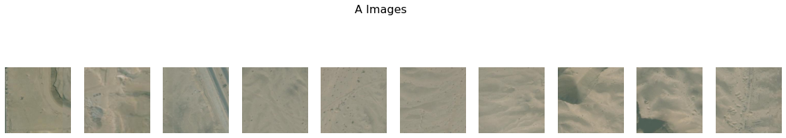
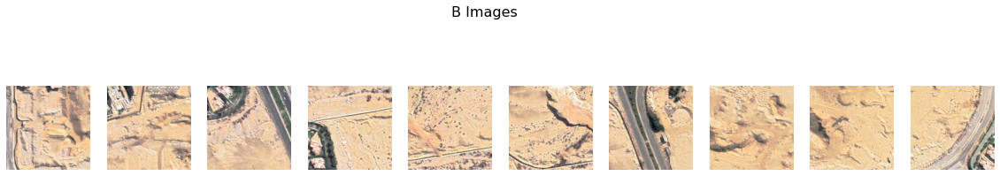
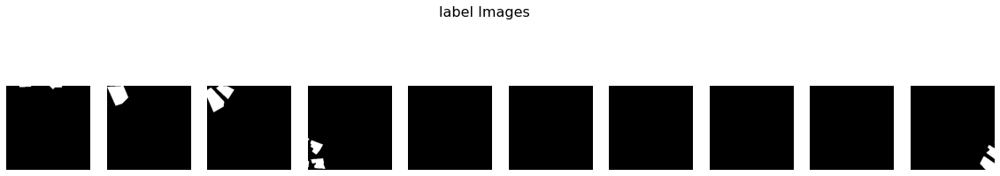
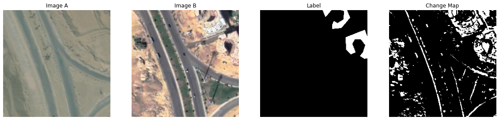
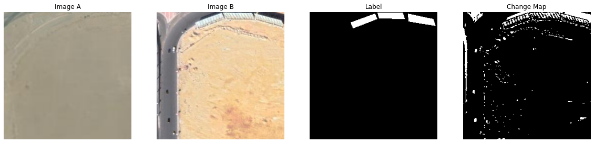
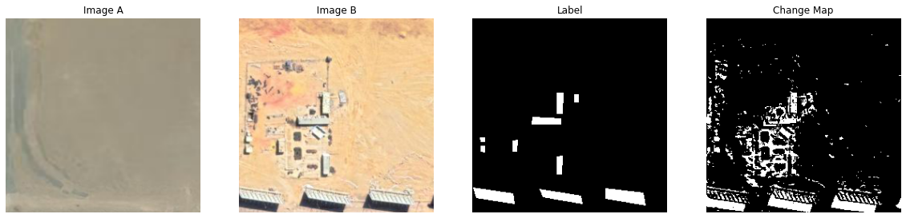
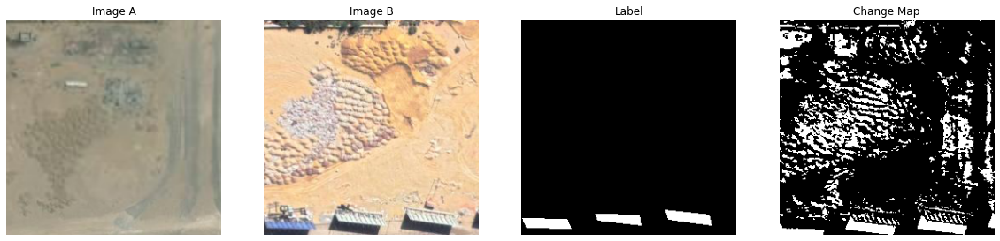
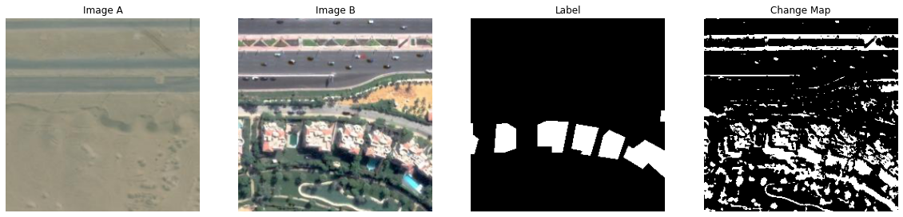
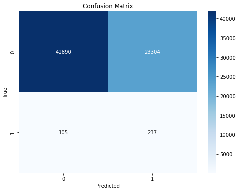

# 🛰️ Change Detection Using Classical and Deep Learning Techniques

## Introduction
Change detection in remote sensing and satellite imagery is essential for monitoring environmental changes, urban development, and natural disasters. Classical image processing techniques and deep learning models offer different approaches to address this task. In this report, we explore the application of classical image differencing and deep learning with the UNet architecture for change detection. We evaluate their performance and discuss how each technique contributes to the final model.

## Dataset:
https://drive.google.com/file/d/1LB53KldZ_hG_Kc2wEBmRjLH0Js80WGgr/view?usp=drive_link

## Methodology

**(1) Classical Techniques Image Differencing** 
Image differencing calculates the absolute difference between corresponding pixels in two images. Thresholding the difference image highlights areas where significant changes have occurred.  

| Threshold | Avg. Jaccard Index | Avg. Accuracy | Avg. Precision | Avg. Recall |
|-----------|-------------------|---------------|----------------|-------------|
| 10        | 0.0677442         | 0.340143      | 0.0710957      | 0.291421    |
| 20        | 0.0659331         | 0.565631      | 0.0738174      | 0.247186    |
| 30        | 0.062596          | 0.697018      | 0.0758923      | 0.205887    |
| 40        | 0.058214          | 0.770572      | 0.0771501      | 0.170395    |
| 50        | 0.0555823         | 0.815453      | 0.0781348      | 0.141112    |
| 60        | 0.0681006         | 0.84696       | 0.0800781      | 0.116451    |
| 70        | 0.106368          | 0.87046       | 0.0825593      | 0.0930399   |
| 80        | 0.157755          | 0.886885      | 0.084565       | 0.0696855   |
| 90        | 0.214162          | 0.897626      | 0.0840736      | 0.0477681   |
| 100       | 0.286778          | 0.904825      | 0.0797122      | 0.0294292   |
| 110       | 0.371924          | 0.910176      | 0.0707807      | 0.0166216   |
| 120       | 0.452802          | 0.914849      | 0.0637324      | 0.00992902  |
| 130       | 0.520226          | 0.919136      | 0.0578192      | 0.00603285  |
| 140       | 0.577758          | 0.922932      | 0.0494842      | 0.00372588  |
| 150       | 0.610318          | 0.926176      | 0.0355965      | 0.00219801  |
| 160       | 0.631106          | 0.92864       | 0.0250742      | 0.00104242  |
| 170       | 0.641981          | 0.93013       | 0.0168872      | 0.000499721 |
| 180       | 0.646474          | 0.930838      | 0.0120472      | 0.000233772 |
| 190       | 0.652523          | 0.931094      | 0.00728623     | 0.000107154 |
| 200       | 0.65863           | 0.931191      | 0.00426897     | 4.61258e-05 |

1. **Jaccard Index (Intersection over Union):**
As the threshold increases, fewer pixels are classified as changed, which reduces the number of true positives (correctly classified changes) but also reduces the number of false positives (incorrectly classified changes). This reduction in both true positives and false positives can lead to an increase in the Jaccard Index because the intersection between the predicted and ground truth change maps may still increase due to a larger reduction in false positives than in true positives. However, there's a point where further increasing the threshold causes the Jaccard Index to decrease due to a significant reduction in true positives, outweighing the reduction in false positives.

2. **Accuracy:**
Accuracy measures the overall correctness of the model. It increases with the threshold because as the threshold increases, more pixels are correctly classified as either changed or unchanged, leading to a higher overall accuracy.

3. **Precision:**
Precision measures the proportion of correctly predicted changed pixels among all pixels predicted as changed. It initially increases because as the threshold increases, only highly confident predictions are considered as changed, leading to fewer false positives. However, after a certain threshold (around 80), precision starts to decrease. This is because as the threshold becomes too high, the model becomes overly conservative and starts to miss some actual changes, leading to more false negatives and thus lower precision.

4. **Recall:**
Recall measures the proportion of correctly predicted changed pixels among all ground truth changed pixels. It decreases with the threshold because as the threshold increases, fewer pixels are classified as changed, leading to more false negatives and thus lower recall.

჻჻჻჻჻჻჻჻჻჻჻჻჻჻჻჻჻჻჻჻჻჻჻჻჻჻჻჻჻჻჻჻჻჻჻჻჻჻჻჻჻჻჻჻჻჻჻჻჻჻ Chosen Threshold =70 ჻჻჻჻჻჻჻჻჻჻჻჻჻჻჻჻჻჻჻჻჻჻჻჻჻჻჻჻჻჻჻჻჻჻჻჻჻჻჻჻჻჻჻჻჻  

**(2) Deep Learning Techniques UNet Architecture:**

1. Encoder-Decoder Structure: 
The UNet architecture consists of an encoder path to capture context and a decoder path to enable precise localization. This structure is ideal for change detection as it allows the model to effectively learn features at different scales, which is important for detecting changes of varying sizes in satellite images. 

2. Skip Connections: 
Skip connections between the encoder and decoder paths help in preserving spatial information lost during downsampling. By concatenating feature maps from the encoder to the corresponding decoder layers, the model can use detailed spatial information from earlier layers to refine segmentation results. This is crucial for maintaining the spatial integrity of change detection maps. 

3. Convolutional Layers: 
The use of convolutional layers helps in capturing hierarchical features from input images. The repeated use of convolutional layers with non-linear activation functions allows the model to learn complex patterns in the data, which is important for accurately detecting changes in satellite images. 

4. Pooling Layers: 
Max pooling layers are used to downsample feature maps, which helps in reducing the spatial dimensions of the input while retaining important features. This is beneficial for change detection as it allows the model to focus on the most relevant parts of the images for detecting changes. 

5. Transpose Convolution (Upconvolution): 
Transpose convolutional layers are used in the decoder path to upsample feature maps. This helps in recovering the spatial resolution lost during downsampling in the encoder path, enabling the model to generate fine-grained segmentation maps. 

6. ReLU Activation: 
The Rectified Linear Unit (ReLU) activation function is used throughout the model to introduce non-linearity, which is important for learning complex relationships in the data. ReLU is computationally efficient and helps in mitigating the vanishing gradient problem during training. 
7. 1x1 Convolution: 
The final layer of the UNet model consists of a 1x1 convolutional layer, which is used to reduce the number of channels to match the desired number of output classes (in this case, 1 for change/no-change). 

## Results:

| Num of epochs | Learning rate | Jaccard index | bce | Dice loss | loss |
|---------------|---------------|---------------|-----|-----------|------|
| 25            | 0.00001       | 0.624279      | 0.152144 | 0.850990 | 0.501567 |
| 25            | 0.0000001     | 0.663928      | 0.678678 | 0.912717 | 0.795697 |
| 25            | 0.011         | 0.706776      | 0.199634 | 0.297323 | 0.248478 |
| 42            | 0.001         | 0.723679      | 0.192397 | 0.277279 | 0.234838 |

